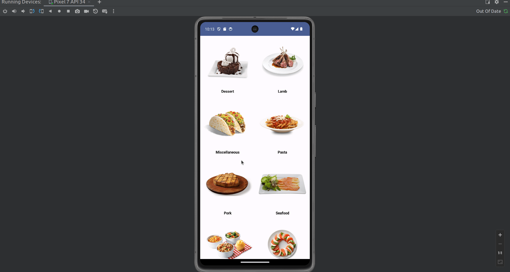

# Kotlin Meals App

- This is a simple meals app that displays a list of meals and their details. 
- The app is written in Kotlin and uses the MVVM architecture pattern. 
- The app uses the [TheMealDB API](https://www.themealdb.com/api.php) to fetch the list of meals and their details.

## Features
- Display a list of meals categories with their images and names
- Display meal details when a meal category is clicked

## Project Structure

The project is structured into several Kotlin files, each serving a specific purpose:

- `ApiService.kt`: This file contains the `ApiService` interface which defines the API endpoints. It uses Retrofit to make HTTP requests and Gson to parse the JSON responses.

- `Category.kt`: This file defines the `Category` and `CategoriesResponse` data classes. These classes are used to hold the data fetched from the API.

- `CategoryDetailScreen.kt`: This file contains the `CategoryDetailScreen` composable function which displays the details of a selected meal category.

- `MainActivity.kt`: This is the main entry point of the app. It sets up the main theme and navigation controller.

- `MainViewModel.kt`: This file contains the `MainViewModel` class which handles the business logic of the app. It fetches the meal categories from the API and updates the UI state.

- `RecipeApp.kt`: This file contains the `RecipeApp` composable function which sets up the navigation for the app.

- `RecipeScreen.kt`: This file contains the `RecipeScreen` and `CategoryScreen` composable functions which display the list of meal categories.

- `Screen.kt`: This file defines the `Screen` sealed class which represents the different screens in the app.

